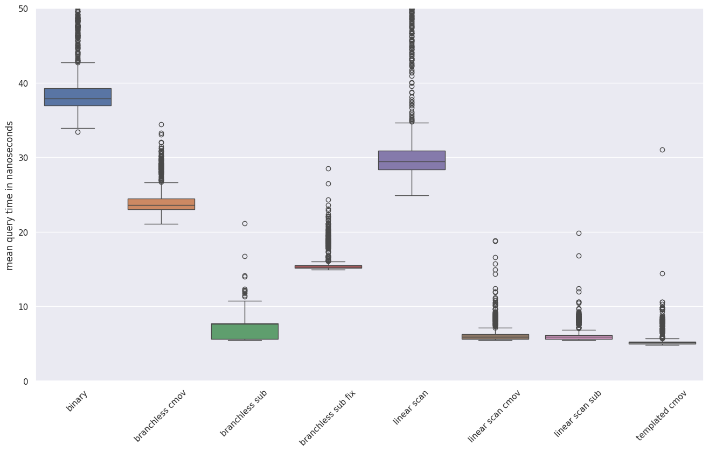

# search_microbench

Benchmark for searching sorted 64 element arrays of signed non-negative 32-bit integers.

Very specific benchmark related to branch selection in [https://github.com/saskeli/bit_vector](https://github.com/saskeli/bit_vector)

Contains 7 implementations:

* `binary` is a naive binary search.
* `branchless_cmov` is based on conditional moves as proposed by Sanders and Winkel1.
* `branchless_sub` uses the sign bit and subtraction instead of conditional moves. Limits search space to [0..2^31 - 1]
* `branchless_sub_fix` is hacked to work for all uint32_t values
* `linear_scan` is a naive linear scan.
* `linear_scan_cmov` is a linear scan based on conditional moves.
* `linear_scan_sub` uses uses sign bit and subtraction instead of conditional moves.
* `templated_cmov` uses templating to do branching efficiently.

## Citing

If you find this michrobenchmark usefull, please cite:

D. Diaz, S. Dönges, S. Puglisi and L. Salmela. Simple Runs-bounded FM-index Designs are Fast. 2023

Better information hopefully following soon (Feb 2023).

## Running

Run default stuff with `make`. Will output timings to "results.tsv".

The "bs_data" python script can be used to generate skewed test data.

See `Makefile`, `branchless.cpp` and `bs_data.py`...

## "Requirements"

Requires python 3.6 or newer for test data generation.

Defaults to c++ 20 standard but should compile fine with older versions as well.

## Results

Running benchmarks on my Intel Core i5-8250U laptop results in 

Tabulated Perf results:

<table border="1" class="dataframe">
  <thead>
    <tr style="text-align: right;">
      <th></th>
      <th>binary</th>
      <th>branchless_cmov</th>
      <th>branchless_sub</th>
      <th>branchless_sub_fix</th>
      <th>linear_scan</th>
      <th>linear_scan_cmov</th>
      <th>linear_scan_sub</th>
      <th>templated_cmov</th>
    </tr>
  </thead>
  <tbody>
    <tr>
      <th>Cycles per search</th>
      <td>75.892100</td>
      <td>42.741000</td>
      <td>12.07410</td>
      <td>29.29800</td>
      <td>54.60020</td>
      <td>11.77600</td>
      <td>10.98410</td>
      <td>10.15770</td>
    </tr>
    <tr>
      <th>Instructions per search</th>
      <td>74.380000</td>
      <td>36.327800</td>
      <td>46.31000</td>
      <td>102.33000</td>
      <td>167.86900</td>
      <td>53.42000</td>
      <td>52.33000</td>
      <td>43.41000</td>
    </tr>
    <tr>
      <th>Banch misspredictions per search</th>
      <td>3.752340</td>
      <td>2.500940</td>
      <td>0.01061</td>
      <td>0.01261</td>
      <td>1.08587</td>
      <td>0.01774</td>
      <td>0.01001</td>
      <td>0.02005</td>
    </tr>
    <tr>
      <th>L1 cache misses per search</th>
      <td>0.001060</td>
      <td>0.000190</td>
      <td>0.00025</td>
      <td>0.00021</td>
      <td>0.00013</td>
      <td>0.00006</td>
      <td>0.00003</td>
      <td>0.00005</td>
    </tr>
    <tr>
      <th>IPC</th>
      <td>0.980075</td>
      <td>0.849952</td>
      <td>3.83549</td>
      <td>3.49273</td>
      <td>3.07452</td>
      <td>4.53635</td>
      <td>4.76414</td>
      <td>4.27359</td>
    </tr>
  </tbody>
</table>

-----------------------------------------------------

1 Sanders, S. (2004). Super Scalar Sample Sort. In Algorithms – ESA 2004 (pp. 784–796). Springer Berlin Heidelberg.
